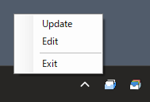

# Quick Launcher

JSONファイルを元に作成される、Windows専用のランチャーです。
タスクトレイに滞在し、右クリックでメニューが出ます。

EXEファイルを登録し、タスクトレイからアプリケーションを起動出来るようになります。
また、フォルダパスを登録する事でブックマークとして使用できます。

Windows11になると、タスクバーに好きなフォルダを登録できなり困ったので作成。
WIndows10以降にプリインストールされてるライブラリのみで作成されてるので、追加ライブラリは不要です。





# コマンドラインオプション

複数起動する事が可能です。設定ファイルや、タスクトレイで表示するアイコンが変更可能です。
目的に応じて、複数個起動して使えます。 例：自分用と、会社共有用など

```powershell
QuickLauncher.exe -json ".\samples\sample.json" -icon ".\samples\sample.ico"
```


# 設定ファイル

## JSON

設定ウインドウとかありません。JSONファイルを直接編集してくだい。

設定ファイルのフォーマットにはJSONを使用してます。
JSONファイルの編集にはVSCodeの使用を推奨します。

手動で書くと若干癖がありますが、JSONファイルの不正な記述を指摘してくれます。
バックスラッシュは、2つ書かないと認識されないので注意してください(スラッシュに置き換えても大丈夫です)。

## サブメニュー

カテゴリ名を入れずに、作成するとメインメニューに追加されます。

```json
[
    {
        "name": "カテゴリ名",  // ここがサブメニュー
        "softwares": [
        // ...
        ]
    }
    {
        "name": "",  // ここがメインメニュー
        "softwares": [
            {
                // ...
            }
        ]
    }
]
```

## セパレーター

`softwares`の項目の中で使用してください。

```json
[
    {
        "name": "カテゴリ名",
        "softwares": [
            {
                // softwareA
            },
            {
                "separator": true
            },
            {
                // softwareB
            }
        ]
    }
]
```

## ソフトウェア

EXEのパスを指定してください。
環境変数が複雑になる場合はBATファイルを指定するのも実用的です。

アイコンは元のEXEを指定すれば取得できます。
パスの指定には、環境変数が使えます。

```json
[
    {
        "name": "カテゴリ名",
        "softwares": [
            {
                "name": "Maya 2024",
                "path": "C:\\Program Files\\Autodesk\\Maya2024\\bin\\maya.exe",
                "icon": "C:\\Program Files\\Autodesk\\Maya2024\\bin\\maya.exe",
                "arguments": "",
                "environments": {
                    "MAYA_UI_LANGUAGE": "en_US",
                    "AW_JPEG_Q_FACTOR": 90
                }
            }
        ]
    }
]
```

## ブックマーク

`path`にフォルダを指定するとブックマークとして使えます。
エクスプローラーで指定されたパスを開きます。

```json
[
    {
        "name": "ブクマーク",
        "softwares": [
            {
                "name": "Program Files",
                "path": "C:\\Program Files"
            }
        ]
    }
]
```
